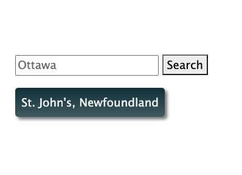
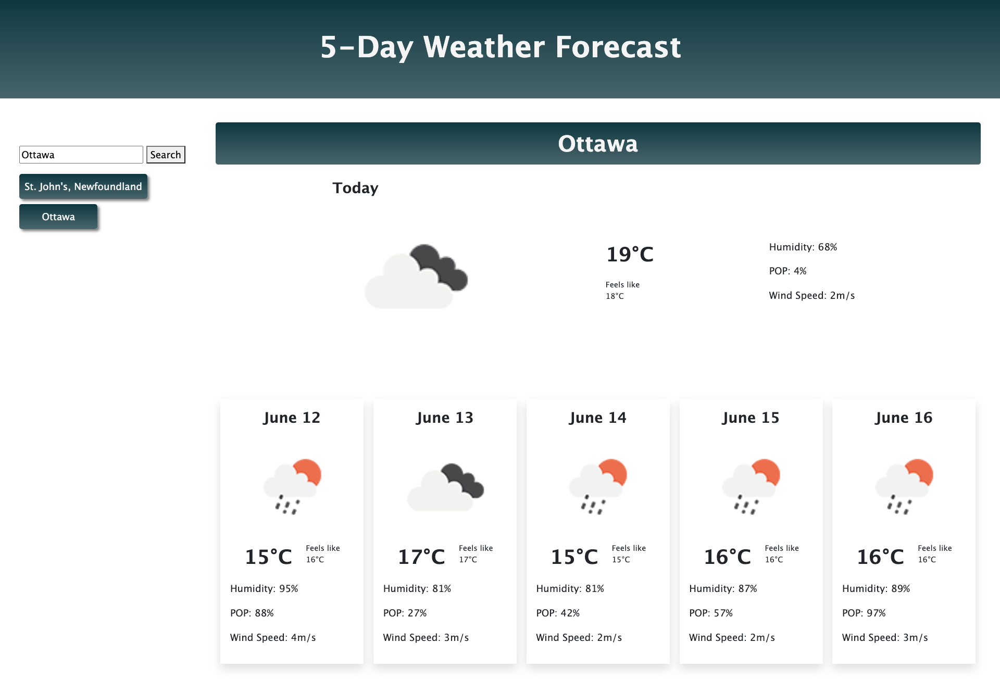
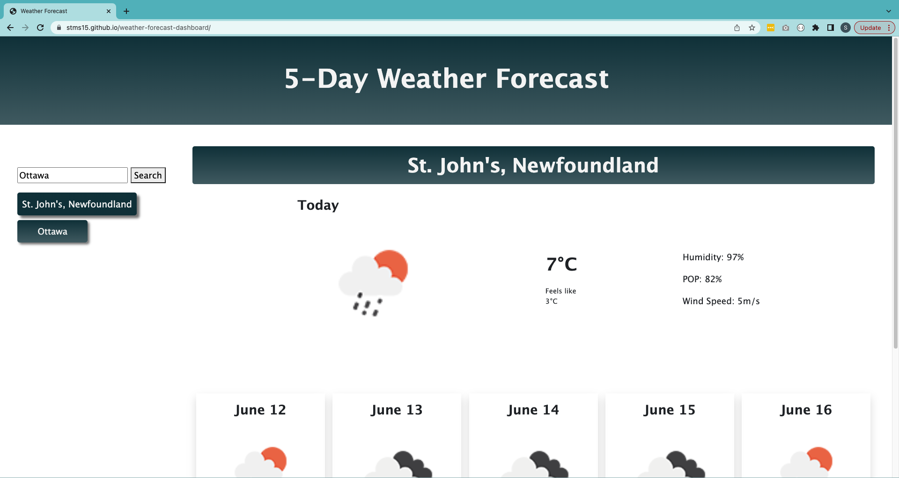

# 5-day Weather Forecast

## Description

The 5-day Weather Forecast website uses the Open Weather Map API to display a 5-day forecast for a city searched for by the user.

On search, the value inputted by the user is used in a URL to request the coordinates of the city using Open Weather Map's Geocoding API. Once the latitude and longitude are received, these values are then used in a second URL to request the weather data for that location for the next 5-days in 3-hour intervals. The weather data is processed, averaged over all available intervals for that day, saved to local storage, and then displayed on screen.

Users can also go back to a previous search using the buttons in the search history. These buttons get and display the data stored locally for the city clicked.

During this project, I learned about asynchronous functions. The API fetch requests inside functions were not finishing before the code continued executing. To fix this, asynchronous functions were needed to wait for a response from the API request before moving on. I also discovered `for of` loops and became more comfortable with the Bootstrap framework.

## Table of Contents

- [Installation](#installation)
- [Usage](#usage)
- [Credits](#credits)
- [License](#license)

## Installation

N/A

## Usage

The deployed application can be accessed here: https://stms15.github.io/weather-forecast-dashboard/.

To use the Weather Forecast site, just search for a city in the search bar. You can search for any city, but note that including the country or state/province name after a comma will help refine the search results to get the correct city (ex: "St. John's, Newfoundland").

That city's 5-day forecast will then be displayed on the page, and the city will be added to the search history. The forecast parameters include an icon indicating the overall main weather, the temperature and "feels like" temperature, the humidity, the possibility of precipitation, and the wind speed.

The API sends data in 3-hour intervals. All of the data points received for each day are averaged over to get the daily forecast. In most cases, the forecast will be the current weather plus the next 5 days. However, in some cases (mainly if requesting data between a particular window at night), there are only exactly 5-days of data received with 8 time intervals per day. In this case, only the weather for the next 5 days is displayed.

If you want to look at the weather for a previous search, you can click the city in the search history to display the results again.

## Credits

W3 Schools was referenced for the correct syntax of `for of` loops: https://www.w3schools.com/js/js_loop_forof.asp and the `Math.max` function: https://www.w3schools.com/jsref/jsref_max.asp.

As mentioned, asynchronous functions were required to wait for the API requests to return responses before other code was executed. To understand how to properly use these functions, https://rapidapi.com/guides/fetch-api-async-await was used.

The <a href="https://getbootstrap.com/docs/5.0/utilities/api/" target="_blank">Bootstrap framework</a> was used for styling. The <a href="https://openweathermap.org/forecast5" target="_blank">Open Weather 5 day weather forecast</a> and <a href="https://openweathermap.org/api/geocoding-api" target="_blank">Geocoding API</a> were the APIs used to obtain the forecast data.

## License

MIT

See the LICENSE file for more details.

---

## Badges

